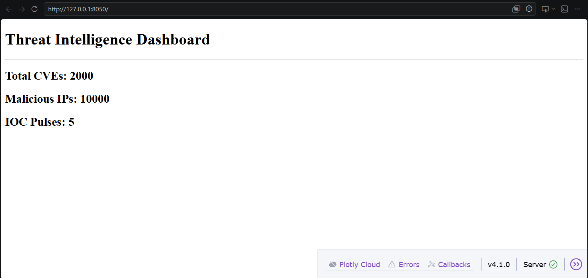
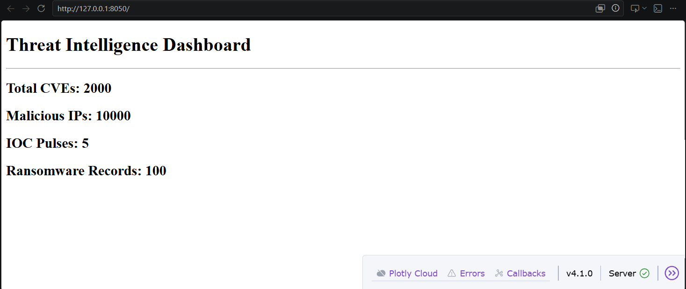
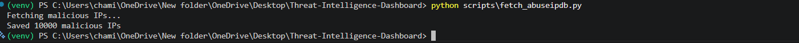
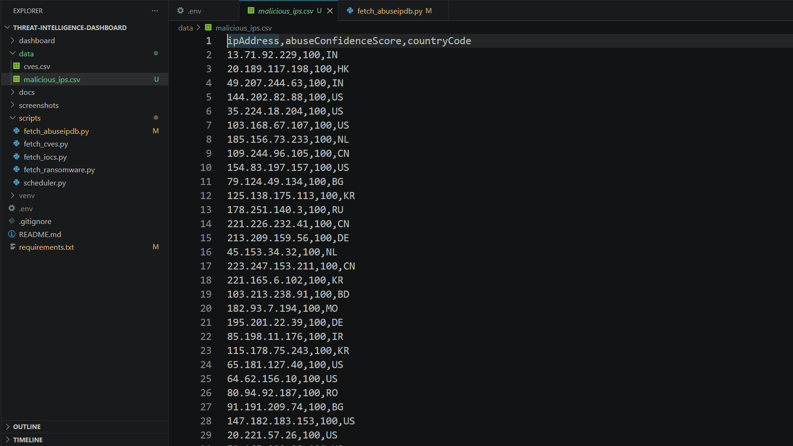
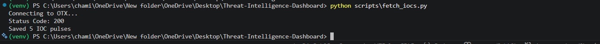
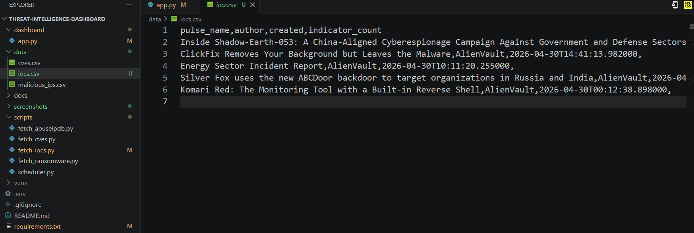
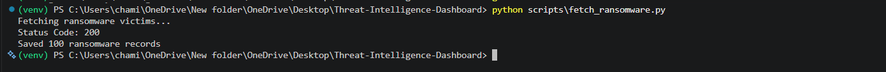
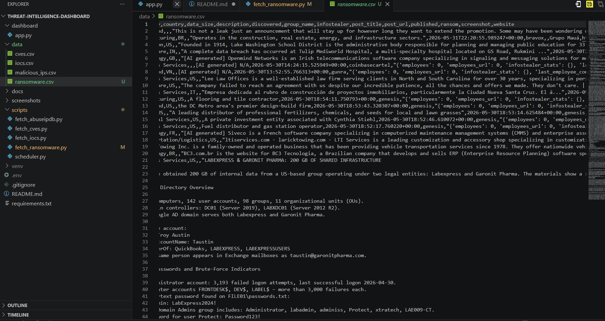

# Threat Intelligence Dashboard

A cybersecurity-focused Threat Intelligence Dashboard that collects, processes, and visualizes threat data from multiple intelligence sources.

## Project Overview

This project was built to demonstrate practical cybersecurity, threat intelligence, automation, and data visualization skills. The dashboard aggregates security data from public threat intelligence feeds and presents it through an interactive web interface.

## Features

### CVE Collection

* Collects Common Vulnerabilities and Exposures (CVEs) from the National Vulnerability Database (NVD) API.
* Stores collected CVE data in CSV format for analysis and visualization.

### Malicious IP Intelligence

* Integrates with the AbuseIPDB API.
* Retrieves high-confidence malicious IP addresses.
* Stores threat intelligence data locally for dashboard visualization.

### IOC Collection

* Integrated with AlienVault OTX API
* Retrieves threat intelligence pulses
* Stores IOC data in CSV format
* Displays IOC metrics on the dashboard

### Ransomware Intelligence

* Collects ransomware victim data from ransomware.live
* Stores ransomware intelligence in CSV format
* Displays ransomware metrics on the dashboard
* Provides visibility into current ransomware activity

### Dashboard Visualization

* Built using Dash and Plotly.
* Displays:

  * Total CVEs collected
  * Total malicious IPs collected
  * Total IOCs collected
  * Total ransomware records collected

* Designed to be extended with additional threat intelligence metrics.

### Secure API Key Management

* Uses environment variables through a `.env` file.
* Prevents sensitive API keys from being exposed in source code or GitHub repositories.

## Technologies Used

* Python
* Pandas
* Requests
* Dash
* Plotly
* NVD API
* AbuseIPDB API
* AlienVault OTX API
* ransomware.live API
* Git
* GitHub

## Project Structure

```text
Threat-Intelligence-Dashboard/
│
├── dashboard/
│   └── app.py
│
├── data/
│   ├── cves.csv
│   ├── iocs.csv
│   ├── malicious_ips.csv
│   └──  ransomware.csv
│
├── docs/
│
├── screenshots/
│   ├── dashboard_v1.png
│   ├── dashboard_v2_abuseipdb.png
│   ├──	dashboard_v3_iocs.png
│   ├──	dashboard_v4_ransomware.png
|   ├── cve_collection1.png
│   ├── cve_collection2.png
│   ├── malicious_ips_collection1.png
│   ├── malicious_ips_collection2.png
|   ├── ioc_collection1.png
|   ├── ioc_collection2.png
|   ├── ransomware_collection1.png
│   └── ransomware_collection2.png
│
├── scripts/
│   ├── fetch_cves.py
│   ├── fetch_abuseipdb.py
│   ├── fetch_iocs.py
│   ├── fetch_ransomware.py
│   └── scheduler.py
│
├── .env
├── .gitignore
├── README.md
└── requirements.txt
```

## Screenshots

### Dashboard Version 1


### Dashboard with AbuseIPDB Integration


### Dashboard with IOC metrics Integration



### Dashboard with ransomware feed Integration



### CVE Collection


### Malicious IP Collection




### IOC Collection



### Ransomware Collection



## Setup Instructions

### Clone the Repository

```bash
git clone https://github.com/YOUR_USERNAME/Threat-Intelligence-Dashboard.git
cd Threat-Intelligence-Dashboard
```

### Create Virtual Environment

```bash
python -m venv venv
```

### Activate Virtual Environment

Windows:

```powershell
.\venv\Scripts\Activate.ps1
```

### Install Dependencies

```bash
pip install -r requirements.txt
```

### Configure Environment Variables

Create a `.env` file:

```text
ABUSEIPDB_API_KEY=YOUR_API_KEY
OTX_API_KEY=YOUR_API_KEY
```

### Run CVE Collection

```bash
python scripts/fetch_cves.py
```

### Run AbuseIPDB Collection

```bash
python scripts/fetch_abuseipdb.py
```

### Run IOC Collection

```bash
python scripts/fetch_iocs.py
```

### Run Ransomware Collection 

```bash
python scripts/fetch_ransomware.py
```

### Launch Dashboard

```bash
python dashboard/app.py
```

## Current Progress

* [x] Project setup
* [x] CVE collection using NVD API
* [x] AbuseIPDB integration
* [x] Basic Dash dashboard
* [x] Environment variable management
* [x] IOC collection (AlienVault OTX)
* [x] Ransomware intelligence feed integration
* [ ] Advanced visualizations
* [ ] Automated scheduling
* [ ] Threat intelligence enrichment

## Future Improvements

* Interactive Plotly visualizations
* Geolocation mapping of malicious IPs
* Threat intelligence enrichment
* Automated threat feed scheduling
* Email alerting system
* IOC type categorization
* Threat trend analytics
* Dashboard filtering and search

## Learning Objectives

This project demonstrates:

* Threat Intelligence Collection
* Cybersecurity Automation
* API Integration
* Security Data Processing
* IOC Management
* Vulnerability Intelligence
* Dashboard Development
* Git & GitHub Workflow
* Secure Secret Management

## Disclaimer

This project is intended for educational and portfolio purposes only. Threat intelligence data is collected from publicly available sources and APIs.
