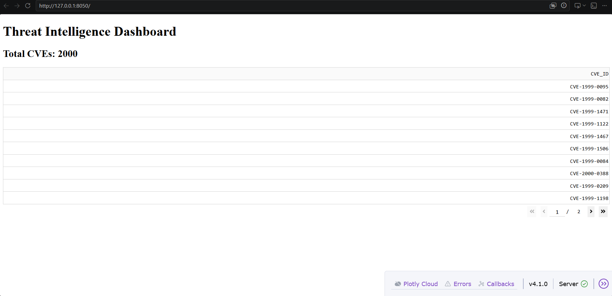
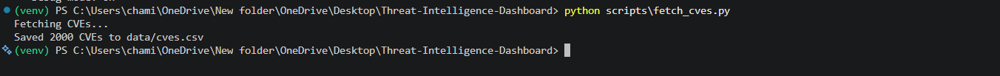
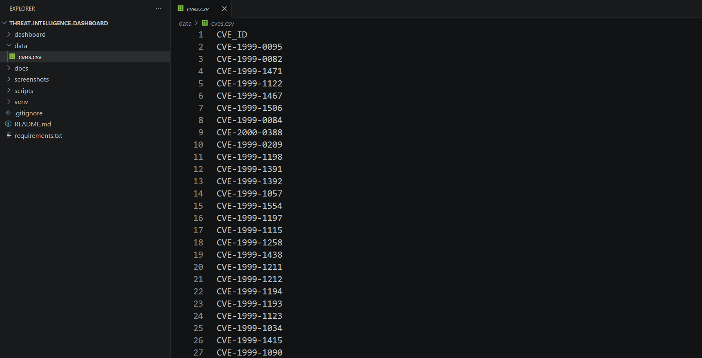
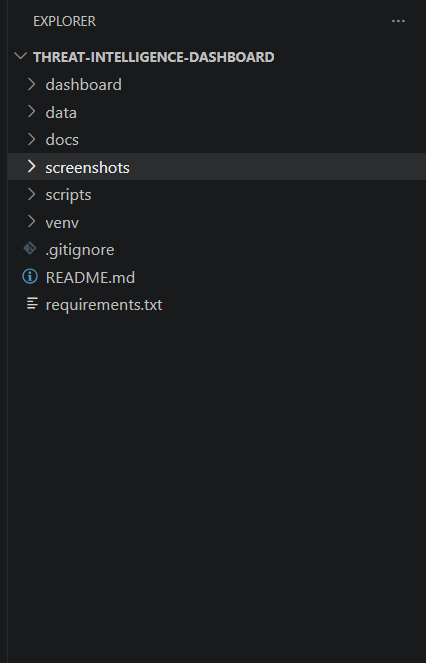

# Threat Intelligence Dashboard

A cybersecurity project that aggregates and visualizes threat intelligence data.

## Features

* CVE collection using the NVD API
* Automated threat data processing
* Interactive dashboard using Dash
* Data storage using CSV files

## Technologies Used

* Python
* Requests
* Pandas
* Dash
* Plotly

## Current Progress

### CVE Collection

Successfully retrieves CVE data from the National Vulnerability Database (NVD) API and stores it locally.

### Dashboard

Displays collected threat intelligence data through a web dashboard.

## Project Structure

```
Threat-Intelligence-Dashboard/
├── dashboard/
├── data/
├── docs/
├── screenshots/
├── scripts/
├── README.md
└── requirements.txt
```

## Screenshots

### Dashboard



### CVE Collection




### Project Structure



## Future Enhancements

* AbuseIPDB integration
* AlienVault OTX IOC feeds
* Ransomware tracking
* Threat intelligence automation
* Data visualization improvements
